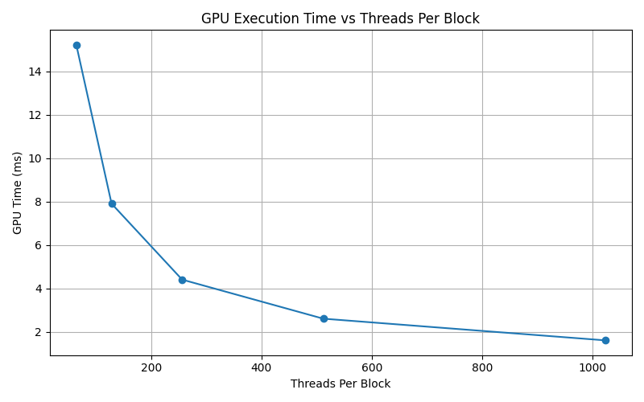
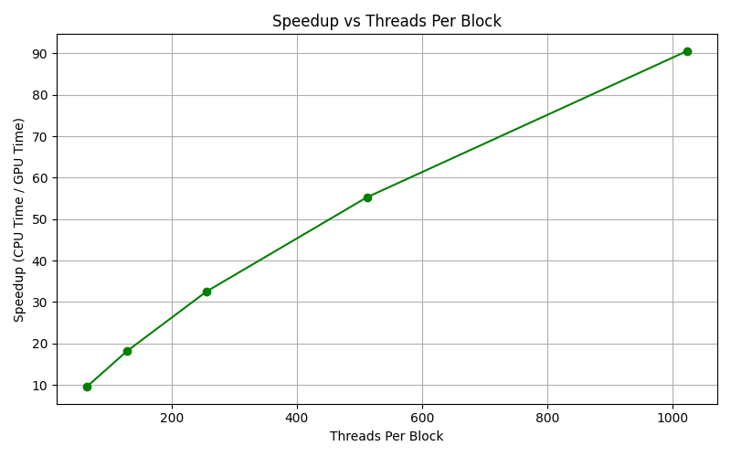

# CUDA 2025 HW1
## Result
| Threads Per Block | GPU Time (ms) | CPU Time (ms) | Speedup (×) |
| ----------------- | ------------- | ------------- | ----------- |
| 64                | 15.200        | 143.920       | 9.44        |
| 128               | 7.900         | 142.600       | 18.04       |
| 256               | 4.400         | 143.720       | 32.78       |
| 512               | 2.600         | 143.240       | 55.30       |
| 1024              | 1.600         | 143.480       | 91.34       |





1. Treand Observation
- Increasing `threadsPerBlock` (`Block Size`) improves GPU time.
- GPU time drops from 15.2 ms (64 threads) to 1.6 ms (1024 threads), a nearly 10× reduction.
2. Speedup
- The GPU achieves a speedup of up to ~91× over the CPU at 1024 threads per block.
- Speedup improves as thread count increases but shows diminishing returns beyond a certain point (e.g., 512 → 1024 is not a 2× gain).

3. Conclusion:
- The optimal threadsPerBlock for this kernel and dataset on your GPU appears to be 1024, achieving both minimal GPU time and maximum speedup.

## Enviroment
- OS: Ubuntu 22.04.3 LTS
- CPU: Intel(R) Core(TM) i7-9800X CPU @ 3.80GHz
- GPU: NVIDIA GeForce RTX 2080 Ti

## Usage
1. Source Files
- Cuda Code: hw1.cu
- Driver Code: driver.py

2. Compile
```bash
nvcc hw1.cu -o hw1
```
3. Single Run
```bash
./hw1 <threadsPerBlock> <blocksPerGrid>
```
4. Block Size Experiment
```
python3 driver.py
```