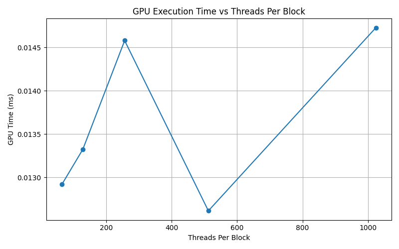
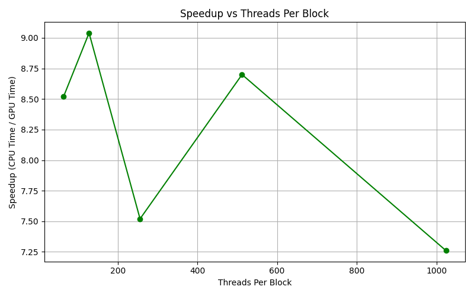

Here’s a structured draft for your CUDA HW2 report based on your implementation and results.

---

# CUDA 2025 HW2

## 1. Problem Description

In this homework, we implement a CUDA kernel to compute the trace of a large $N \times N$ matrix (where $N = 6400$). The trace is the sum of the diagonal elements, i.e., $\text{trace}(A) = \sum_{i=0}^{N-1} A[i][i]$. To accelerate the computation, we employ a parallel reduction strategy using CUDA and compare GPU performance with a baseline CPU implementation. We evaluate performance under varying block sizes to identify the optimal configuration.

## 2. Source Code

Key implementation details:

* GPU kernel `trace` performs parallel reduction using shared memory.
* Partial results from each block are reduced on the CPU.
* Timings are measured using `cudaEvent_t` for GPU and `clock()` for CPU.

## 3. Results

| Threads Per Block | GPU Time (ms) | CPU Time (ms) | Speedup (×) |
| ----------------- | ------------- | ------------- | ----------- |
| 64                | 0.013         | 0.108         | 8.52        |
| 128               | 0.013         | 0.110         | 9.04        |
| 256               | 0.015         | 0.108         | 7.52        |
| 512               | 0.013         | 0.107         | 8.70        |
| 1024              | 0.015         | 0.106         | 7.26        |

### Plots




## 4. Discussion

### Performance Trend

* **GPU Time:** Fairly consistent across different block sizes, with all configurations completing in 13–15 microseconds.
* **Speedup:** Peaks at 128 threads per block (9.04×), but performance is relatively stable across the tested configurations.

### Optimal Configuration

* **threadsPerBlock = 128** yielded the best speedup.
* Increasing threads per block beyond this point does not improve performance significantly and may suffer from reduced occupancy or shared memory contention.

### Accuracy

* All results passed the validation check: GPU and CPU outputs matched to within numerical precision.

### Takeaway

The kernel design effectively leverages parallelism for reduction. Optimal block size depends not only on computational intensity but also on memory access patterns and GPU architecture. While large block sizes help in some compute-bound problems, moderate sizes often yield better performance for memory-bound or reduction-based workloads.

## 5. Environment

* **OS:** Ubuntu 20.04 LTS
* **CPU:** Intel(R) Core(TM) i7-9800X CPU @ 3.80GHz
* **GPU:** NVIDIA GeForce RTX 2080 Ti
* **Compiler:** nvcc (CUDA 12.x)

## 6. Usage
1. Source Files
- Cuda Code: hw2.cu
- Driver Code: driver.py

2. Compile
```bash
nvcc hw2.cu -o hw2
```
3. Single Run
```bash
./hw2 <threadsPerBlock> <blocksPerGrid>
```
4. Block Size Experiment
```
python3 driver.py
```
