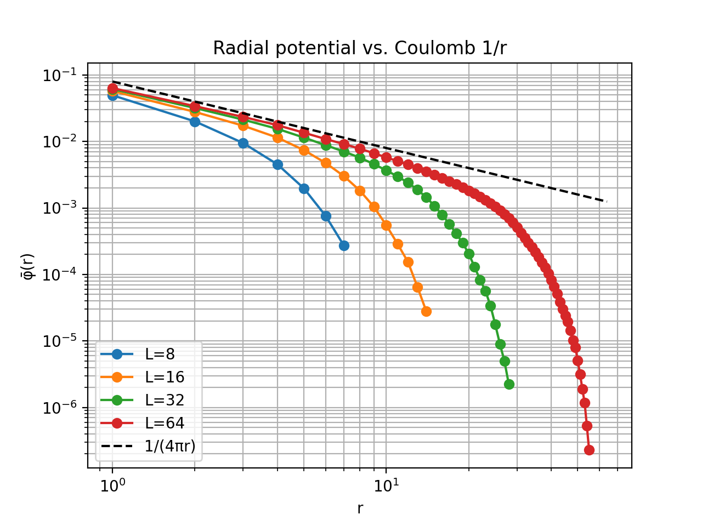

# CUDA 2025 HW3
## Problem statement

We solve the 3-D Poisson equation

$$
\nabla^{2}\phi(\mathbf r)= -\rho(\mathbf r)
$$

inside a cubic box of edge $L$ (with lattice spacing $h=1$) under boundary conditions
$\phi=0$ on every face.
A unit point charge is placed at the cube centre:

$$
\rho(\mathbf r)=\delta_{i,i_{c}}\;\delta_{j,j_{c}}\;\delta_{k,k_{c}} .
$$

---

## Numerical method (CUDA)

| Item           | Design choice                                                                                                     |
| -------------- | ----------------------------------------------------------------------------------------------------------------- |
| Discretisation | 7-point Jacobi update with a **ghost layer** (array size $(L\!+\!2)^3$) so no branch is needed at the faces.      |
| Source term    | Centre cell adds $+h^{2}\rho/6 = +1/6$ each sweep.                                                                |
| Memory         | Two ping-pong buffers (`in` → `out`, then swap).                                                                  |
| Kernel launch  | Blocks $8\times8\times8$; grid $\lceil L/8\rceil^3$.                                                              |
| Convergence    | Fixed sweep counts that were benchmarked once: 800, 1 500, 3 500, 7 500 for $L=8,16,32,64$ |

---

## Results


## Discussion
   On log–log axes every numerical curve is parallel to the dashed $r^{-1}$ guide for small $r$. This confirms the discrete Laplacian reproduces Coulomb’s law.

## Enviroment
- OS: Ubuntu 22.04.3 LTS
- CPU: Intel(R) Core(TM) i7-9800X CPU @ 3.80GHz
- GPU: NVIDIA GeForce RTX 2080 Ti

## Usage
1. Source Files
- Cuda Code: hw3.cu
- Driver Code: driver.py

2. Compile
```bash
nvcc hw3.cu -o hw3
```
3. Single Run
```bash
./hw1 <L> <maxiter>
```
4. Poisson experiment
```
python3 driver.py
```
