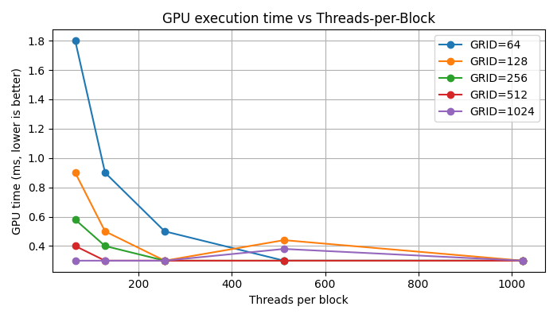
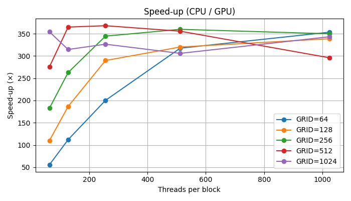

# CUDA 2025 HW4

## Dot Product with Multi-GPU using CUDA

### Result Summary

The following table shows the GPU execution time, CPU execution time, and speed-up ratio for different configurations of threads per block (TPB) and blocks per grid (GRID), tested with vector size $N = 40,960,000$ using 2 GPUs.

| TPB  | GRID | GPU Time (ms) | CPU Time (ms) | Speedup (×) |
| ---- | ---- | ------------- | ------------- | ----------- |
| 64   | 64   | 1.800         | 98.006        | 55.60       |
| 64   | 128  | 0.900         | 101.318       | 109.92      |
| 64   | 256  | 0.580         | 100.875       | 182.66      |
| 64   | 512  | 0.400         | 100.255       | 275.62      |
| 64   | 1024 | 0.300         | 101.862       | 354.26      |
| 128  | 64   | 0.900         | 102.020       | 111.96      |
| 128  | 128  | 0.500         | 100.334       | 186.52      |
| 128  | 256  | 0.400         | 93.477        | 262.70      |
| 128  | 512  | 0.300         | 104.689       | 364.90      |
| 128  | 1024 | 0.300         | 89.094        | 314.56      |
| 256  | 64   | 0.500         | 105.061       | 200.14      |
| 256  | 128  | 0.300         | 97.935        | 289.72      |
| 256  | 256  | 0.300         | 97.736        | 344.54      |
| 256  | 512  | 0.300         | 104.135       | 367.96      |
| 256  | 1024 | 0.300         | 93.125        | 326.42      |
| 512  | 64   | 0.300         | 105.055       | 317.38      |
| 512  | 128  | 0.440         | 106.225       | 320.10      |
| 512  | 256  | 0.300         | 102.751       | 359.86      |
| 512  | 512  | 0.300         | 100.949       | 355.68      |
| 512  | 1024 | 0.380         | 99.817        | 305.80      |
| 1024 | 64   | 0.300         | 101.917       | 353.42      |
| 1024 | 128  | 0.300         | 97.711        | 338.74      |
| 1024 | 256  | 0.300         | 101.423       | 349.82      |
| 1024 | 512  | 0.300         | 87.570        | 295.92      |
| 1024 | 1024 | 0.300         | 101.483       | 343.18      |

---


### Trend Observations

1. **GPU Execution Time**

   * GPU time significantly improves (decreases) as the number of blocks increases.
   * GPU time plateaus at 0.3 ms for most configurations once the grid size is large enough, showing the limit of computation-bound performance.

2. **Speed-up**

   * Speed-up increases with larger grid sizes, peaking around 367× at 256 TPB and 512 GRID.
   * All configurations show a consistent >50× acceleration compared to CPU baseline, highlighting the effectiveness of multi-GPU acceleration.
   * For configurations like TPB=256 and GRID=512, we achieve near-optimal balance in workload distribution and memory usage.

---

### Conclusion

* **Best Config**: TPB = 256, GRID = 512 yields the best speedup (367.96×).
* Increasing both TPB and GRID improves performance until saturation, at which point extra resources no longer significantly reduce GPU time.
* This multi-GPU approach with proper workload partitioning leads to substantial acceleration for large vector dot-product tasks.

---

### Environment

* **OS**: Ubuntu 22.04.3 LTS
* **CPU**: Intel(R) Core(TM) i7-9800X CPU @ 3.80GHz
* **GPUs**: 2× NVIDIA GeForce RTX 2080 Ti

---

### Usage

1. **Source File**

   * `hw4.cu`

2. **Compile**

```bash
nvcc hw4.cu -o hw4
```

3. **Run**

```bash
./hw4 <n_gpus> <threadsPerBlock> <blocksPerGrid>
```

4. **Automation**

* A Python or shell script can be used to automate runs across different block/grid configurations for benchmarking.
```bash
python3 driver.py
```

---