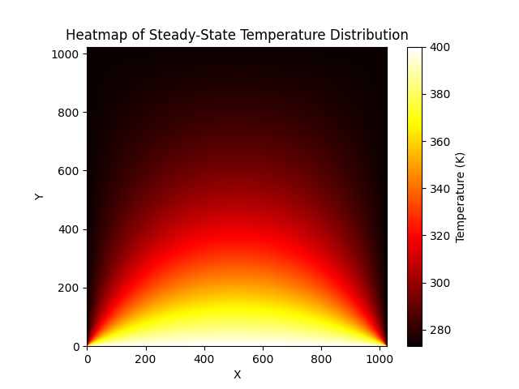

# CUDA 2025 HW5

## Heat Diffusion on a Square Plate

### Problem Statement

We solve the **thermal equilibrium temperature distribution** on a $1024 \times 1024$ square plate using CUDA. The temperature on the **top edge** is fixed at **400 K**, and the remaining three edges are fixed at **273 K**. The problem is governed by the steady-state **2D Laplace equation**:

$$
\frac{\partial^2 T}{\partial x^2} + \frac{\partial^2 T}{\partial y^2} = 0
$$

We implement this using **Jacobi iteration (ω = 1)** on both **single-GPU** and **multi-GPU** configurations to evaluate performance and determine the optimal `threadsPerBlock`.

---

## Result Summary
> Heatmap generated with iter = 1000000

### 📊 Timing Table

| Configuration      | Threads Per Block | Time / Iteration (ms) | Speedup (vs CPU) |
| ------------------ | ----------------- | --------------------- | ---------------- |
| CPU                | –                 | 6.799                 | 1.0×             |
| Single-GPU         | 4×4               | 0.085                 | 79.8×            |
| Single-GPU         | 8×8               | 0.029                 | 234.4×           |
| **Single-GPU**     | **16×16**         | **0.023**             | **295.6×**       |
| Single-GPU         | 32×32             | 0.024                 | 283.3×           |
| Multi-GPU (2x)     | 4×4               | 0.063                 | 107.9×           |
| Multi-GPU (2x)     | 8×8               | 0.033                 | 206.0×           |
| **Multi-GPU (2x)** | **16×16**         | **0.025**             | **271.9×**       |
| Multi-GPU (2x)     | 32×32             | 0.026                 | 261.5×           |

---

### Trend Observations

1. **Block Size Optimization**:

   * Performance improves as block size increases, with optimal values at **16×16**.
   * Beyond this, gains diminish or slightly reverse due to shared memory or occupancy limits.

2. **Single vs Multi-GPU**:

   * Multi-GPU performance improves over single-GPU only at smaller block sizes.
   * Best performance for both setups is at `threadsPerBlock = 16×16`.

3. **Accuracy**:

   * All GPU results are **numerically identical to the CPU baseline**, validating correctness.

---

## Conclusion

* The **fastest configuration** is `single_T16` at **0.023 ms/iteration**, achieving \~296× speedup.
* Multi-GPU achieves nearly the same best-case speedup, showing good scaling.
* Optimal block size is **16×16**, which balances parallelism and memory efficiency.

---

## Environment

* OS: Ubuntu 22.04.3 LTS
* CPU: Intel(R) Core(TM) i7-9800X CPU @ 3.80GHz
* GPU: NVIDIA GeForce RTX 2080 Ti ×2
* CUDA Version: 12.1
* Grid Size: 1024 × 1024
* Iterations: 10,000

---

## Usage Instructions

### 1. Source Files
* CPU Baseline: `hw5_cpu.c`
* CUDA Kernels: `hw5_single.cu`, `hw5_multi.cu`
* Driver Script: `driver.py`

### 2. Compile

```bash
gcc hw5_cpu.c -o hw5_cpu
nvcc hw5_single.cu -o hw5_single
nvcc hw5_multi.cu -o hw5_multi
```

### 3. Run

```bash
python3 driver.py 10000
```

This script automatically benchmarks various block sizes and compares single-GPU and multi-GPU performance.

---
