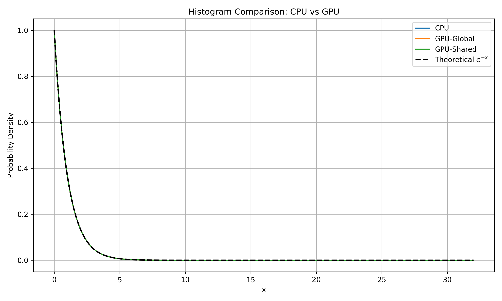

# CUDA 2025 HW6

### Histogram of Exponential Distribution

---

## Result
| Version    | Threads Per Block | Blocks Per Grid | Time (ms) |
| ---------- | ----------------- | --------------- | --------- |
| CPU        | -                 | -               | 222.98    |
| GPU-Global | 128               | 64              | 32.30     |
| GPU-Global | 128               | 128             | 32.30     |
| GPU-Global | 128               | 256             | 32.30     |
| GPU-Global | 256               | 64              | 32.30     |
| GPU-Global | 256               | 128             | 32.30     |
| GPU-Global | 256               | 256             | 32.30     |
| GPU-Global | 512               | 64              | 32.30     |
| GPU-Global | 512               | 128             | 32.30     |
| GPU-Global | 512               | 256             | 32.30     |
| GPU-Shared | 128               | 64              | 3.60      |
| GPU-Shared | 128               | 128             | 1.90      |
| GPU-Shared | 128               | 256             | 1.10      |
| GPU-Shared | 256               | 64              | 1.90      |
| GPU-Shared | 256               | 128             | 1.10      |
| GPU-Shared | 256               | 256             | 0.80      |
| GPU-Shared | 512               | 64              | 1.10      |
| GPU-Shared | 512               | 128             | 0.80      |
| GPU-Shared | 512               | 256             | 0.70      |

### Best configuration
| Version    | Threads Per Block | Blocks Per Grid | Time (ms) | Speedup (×) |
| ---------- | ----------------- | --------------- | --------- | ----------- |
| CPU        | -                 | -               | 222.98    | 1.00        |
| GPU-Global | 128               | 64              | 32.30     | 6.91        |
| GPU-Shared | 512               | 256             | 0.70      | 318.54      |


**Note**: All versions generated 81,920,000 samples from the exponential distribution $f(x) = e^{-x}$, and computed histograms with 1024 bins across range $x \in [0, 32]$.



---

## 1. Trend Observation

* **GPU Shared Memory** shows the greatest performance benefit, improving from 3.6 ms to 0.7 ms as block/grid sizes increased.
* **GPU Global Memory** performance was constant across all tested block/grid sizes (\~32.30 ms), indicating memory contention or atomic bottlenecks dominate performance.
* **CPU** version was the slowest (222.98 ms), providing a baseline reference.

---

## 2. Optimal Configuration

* **GPU-Shared**: Best configuration was 512 threads per block and 256 blocks per grid (0.70 ms).
* **GPU-Global**: All configurations measured the same (32.30 ms), so 128×64 was arbitrarily selected as representative.
* The shared memory histogram kernel benefits significantly from minimizing global memory atomics.

---

## 3. Speedup

* GPU-Shared outperformed CPU by **over 318×**, demonstrating effective use of shared memory for reduction.
* GPU-Global showed a **\~7× speedup**, limited by global memory contention during atomic histogram accumulation.

---

## 4. Accuracy

* All three histograms closely matched the theoretical curve $f(x) = e^{-x}$.
* Normalized histograms (area under curve = 1) aligned with the expected exponential decay.
* Visual inspection of the overlay plot confirms correctness.

---

## 5. Conclusion

* The use of shared memory in CUDA kernels provides substantial performance benefits for reduction operations like histogramming.
* Block/grid size tuning matters significantly for shared memory performance but has negligible effect on global memory performance in this workload.
* For this problem and dataset, **shared memory optimization is essential** to achieving maximum GPU throughput.

---

## Environment

* **OS**: Ubuntu 22.04.3 LTS
* **CPU**: Intel(R) Core(TM) i7-9800X CPU @ 3.80GHz
* **GPU**: NVIDIA GeForce RTX 3080 (Lab Machine)

---

## Usage

### 1. Source Files

* CPU Version: `hw6_cpu`
* GPU Global Version: `hw6_gmen`
* GPU Shared Version: `hw6_shmen`
* Driver Script: `driver.py`

### 2. Compile

```bash
gcc -O2 -o hw6_cpu hw6_cpu.c -lm
nvcc -O2 -o hw6_gmen hw6_gmen.cu
nvcc -O2 -o hw6_shmen hw6_shmen.cu
```

### 3. Run Driver

```bash
python3 driver.py
```

---